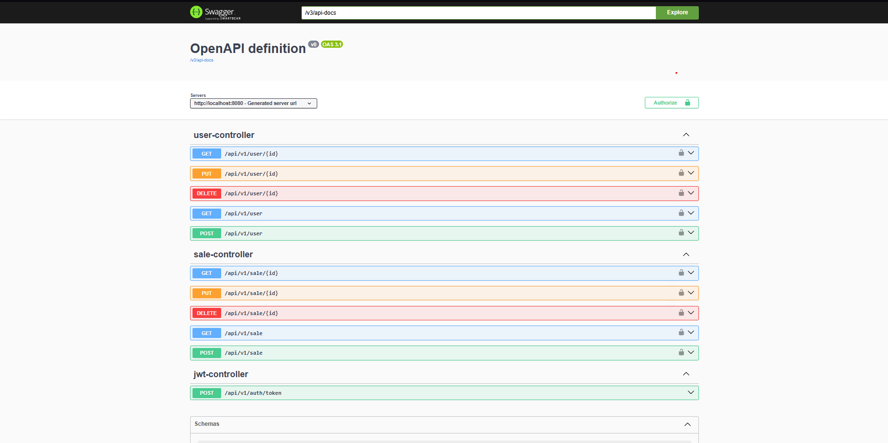

# 💵 Payment Manager

## 🔭 Overview

The **Payment Manager** is a payment management system built using **Java 21**, **Spring Boot**, and various modern technologies. This application allows users to authenticate and manage their sales, keeping track of payment methods and their validity dates. Once a sale's validity period expires, the sale will be marked as unpaid. 

This system is designed to handle multiple payment methods, track the expiration date of each payment, and provide a clean and efficient way to manage all transactions. Each user can manage their own sales, ensuring that they have clear visibility over the payments they need to make.



## 👩‍💻 Key Features

- **User Authentication**: Secure user authentication using **Spring Security** and **JWT** (JSON Web Tokens).
- **Sale Management**: Users can create, view, and manage sales with specified payment methods and expiration dates.
- **Payment Method Tracking**: Track the various payment methods used for each sale.
- **Sale Expiration**: Sales are automatically marked as "unpaid" if the expiration date has passed.
- **Custom Queries**: Custom queries are available to retrieve sales, payment information, and user data in a flexible manner.
- **Pagination**: Pagination is implemented for efficient data retrieval when listing sales or user transactions.
- **Scheduled Tasks**: Background tasks to check for expired sales and update their status accordingly.
- **Swagger Documentation**: API documentation using **Swagger** to simplify integration with other systems or for testing purposes.

## 👜 Technologies Used

- **Java 21** - The latest version of Java for building modern and efficient applications.
- **Spring Boot** - The core framework for building the RESTful API and handling business logic.
- **Spring Security** - Used to secure the application and provide authentication and authorization.
- **JWT** - JSON Web Tokens for stateless user authentication.
- **PostgreSQL** - The primary database for storing user and sales data.
- **H2** - In-memory database for development and testing purposes.
- **Lombok** - Reduces boilerplate code for data models and other entities.
- **Swagger** - For automatic API documentation and testing endpoints.
- **MapStruct** - For efficient and type-safe object mapping between DTOs and entities.
- **Design Pattern Strategy** - Used for handling different payment strategies.
- **JUnit** - For unit testing and ensuring code reliability.
- **SOLID Principles** - Ensures the system is maintainable and follows best object-oriented design principles.
- **MVC Pattern** - The system follows the Model-View-Controller pattern to separate concerns and provide a clean architecture.
- **Scheduled Tasks** - Background tasks for handling automatic updates on expired sales.

## 📊 Class Diagram

This is the class diagram for the sales management system. It describes the structure of the main entities in the system.

```mermaid
classDiagram
    class User {
        +UUID id
        +String username
        +String email
        +String password
        +List<Role> roles
    }

    class Sale {
        +UUID id
        +String description
        +String code
        +StatusSale status
        +LocalDate dateToPay
        +LocalDate datePayed
        +List<Payment> payments
        +BillingDetails billingDetails
        +Boolean checkDatePayedIsNotNull()
        +Boolean checkPaymentsIsNullOrEmpty()
    }

    class Payment {
        +UUID id
        +PaymentMethod paymentMethod
        +BigDecimal amountReceived
        +Sale sale
    }

    class BillingDetails {
        +UUID id
        +BigDecimal totalAmountToPay
        +BigDecimal totalPaid
        +BigDecimal cashBack
        +Sale sale
    }

    User "1" -- "*" Sale : "Has"
    Sale "1" -- "*" Payment : "Contains"
    Sale "1" -- "1" BillingDetails : "Has"
    Payment "*" -- "1" Sale : "Belongs to"
    BillingDetails "*" -- "1" Sale : "Belongs to"
  ````````

## 🛠️ Setup & Installation

1. Clone the repository:

   ```bash
   git clone https://github.com/your-username/payment-manager.git

2. Navigate to the project directory::

   ```bash
   cd payment-manager

3. Build the application with Maven:

   ```bash
   mvn clean install

4. Run the application:

   ```bash
   mvn spring-boot:run

5. Access the API documentation at http://localhost:8080/swagger-ui/
